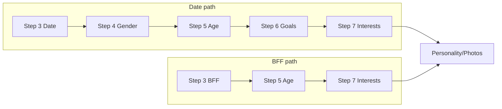

# Age range step in onboarding (Date and BFF)

## Current flow (summary)

- **Substeps:** 0 profile → 1 gender → 2 invite code → 3 Date/BFF → 4 who to meet (Date only) → 5 relationship goals (Date only) → 6 interests → 7 personality → 8 photos. `TOTAL_SUB_STEPS = 9`.
- **Date:** 3 → 4 (gender pref, currently hardcodes `ageRangeMin: 18, ageRangeMax: 55`) → 5 (goals) → 6…
- **BFF:** 3 → skip to 6 (no gender-pref or age step today).
- **Backend:** `Preferences` has `ageRangeMin` / `ageRangeMax`; `upsertGenderPreference` accepts optional age; status does not expose age or “gender preference done”.

## Target flow

- **Date:** 3 (Date/BFF) → 4 (who to meet) → **5 (age range)** → 6 (goals) → 7 interests → 8 personality → 9 photos.
- **BFF:** 3 (BFF) → **5 (age range)** → 7 interests → 8 personality → 9 photos.
- **Rules:** `ageRangeMin` ≥ 18, `ageRangeMax` ≤ 100, `ageRangeMin` ≤ `ageRangeMax`.

## 1. Backend

### 1.1 Validation

- **File:** [my-app/src/validations/onboarding.validation.ts](my-app/src/validations/onboarding.validation.ts)
- Add `ageRangeSchema`: `ageRangeMin` (int, 18–100), `ageRangeMax` (int, 18–100), `.refine(max >= min)` with message `"ageRangeMax must be >= ageRangeMin"`. Export type `AgeRangeInput`.

### 1.2 Repository

- **File:** [my-app/src/repositories/OnboardingRepository.ts](my-app/src/repositories/OnboardingRepository.ts)
- In `getOnboardingStatus`, extend the preferences `select` to include `genderPreference`, `ageRangeMin`, `ageRangeMax`.
- Return in status: `ageRangeMin`, `ageRangeMax`, and `hasGenderPreference: (preferences?.genderPreference?.length ?? 0) > 0`.
- Add `upsertAgeRange(userId, data: AgeRangeInput)`: update only `ageRangeMin` and `ageRangeMax` on `Preferences` (upsert by `userId`; on create use sensible defaults e.g. 18/55). Add to `IOnboardingRepository`.

### 1.3 Service

- **File:** [my-app/src/services/OnboardingService.ts](my-app/src/services/OnboardingService.ts)
- Add `saveAgeRange(userId, input)` that calls `onboardingRepo.upsertAgeRange(userId, input)`.
- In `completeOnboarding`: if `relationshipIntent` is `"date"` or `"friendship"`, require both `ageRangeMin` and `ageRangeMax` to be set (e.g. non-null); add to `missing` if not.

### 1.4 Controller and route

- **File:** [my-app/src/controllers/OnboardingController.ts](my-app/src/controllers/OnboardingController.ts)  
Add `saveAgeRange`: parse body with `ageRangeSchema`, call `onboardingService.saveAgeRange(ctx.userId, input)`, return created response.
- **New file:** `my-app/src/app/api/onboarding/age-range/route.ts`  
`POST` → `container.onboardingController.saveAgeRange(req, ctx)`.

## 2. Frontend

### 2.1 Status type and initial substep

- **File:** [my-app/src/app/onboarding/page.tsx](my-app/src/app/onboarding/page.tsx)  
Extend `OnboardingStatus`: `ageRangeMin?: number`, `ageRangeMax?: number`, `hasGenderPreference?: boolean`.
- **File:** [my-app/src/app/onboarding/OnboardingShell.tsx](my-app/src/app/onboarding/OnboardingShell.tsx)
- Set `TOTAL_SUB_STEPS = 10`.
- **getInitialSubStep:**  
  - Date: if `!hasGenderPreference` → 4; if `hasGenderPreference && !hasAgeRange` → 5; if `hasAgeRange` → 6.  
  - BFF: if `!hasAgeRange` → 5; else → 7.  
  - “Undecided” (if still used) → 6.  
  - No preferences complete and not date/bff/undecided → 3.  
  Define `hasAgeRange = status.ageRangeMin != null && status.ageRangeMax != null`.

### 2.2 Substep renumbering and navigation

- Renumber all substep checks and UI blocks: current 4→4, 5→6, 6→7, 7→8, 8→9. Insert new **substep 5** (age range).
- **Step 3 (Date/BFF):** When user selects BFF and clicks Next: save dating mode, then `setSubStep(5)` (not 6).
- **Step 4 (gender preference):** On Next, stop sending hardcoded age; only send `genderPreference` (and “open to all”). Then `setSubStep(5)`.
- **New Step 5 (age range):**  
  - Local state: `ageRangeMin`, `ageRangeMax` (numbers; init from `status.ageRangeMin ?? 18`, `status.ageRangeMax ?? 55`), `ageRangeError`.  
  - UI: heading e.g. “What age range are you open to?”, two number inputs (or dropdowns) for min/max, helper text “Min 18, max 100. Min must be less than or equal to max.”  
  - Validation: 18 ≤ min ≤ 100, 18 ≤ max ≤ 100, min ≤ max; set `ageRangeError` and block Next if invalid.  
  - On Next: `POST /api/onboarding/age-range` with `{ ageRangeMin, ageRangeMax }`; on success, `setSubStep(datingMode === "date" ? 6 : 7)`.
- **Step 6 (goals):** unchanged logic, now at index 6.
- **Steps 7–9:** interests (7), personality (8), photos (9). Update `handleNext`/`handleSkip` and any `subStep === 8` for photos to `subStep === 9`.
- **canProceed:** for `subStep === 5`: both values set and valid (18–100, min ≤ max).
- **Progress:** `progressPct = ((subStep + 1) / 10) * 100`. Photos step when `subStep === 9`.

### 2.3 Age range screen design (concise)

- Same shell style as other steps: icon, serif heading, short description.
- Two inputs (number type, min/max attributes 18/100), labels “Minimum age” and “Maximum age”.
- Inline error via existing `InlineError` for `ageRangeError` (e.g. “Minimum must be 18–100 and less than or equal to maximum.”).
- Bottom: FAB Next; `canProceed` only when valid.

## 3. Data flow (high level)

## 4. Files to touch (checklist)

| Layer       | File(s)                                                                                                                            |
| ----------- | ---------------------------------------------------------------------------------------------------------------------------------- |
| Validation  | `onboarding.validation.ts` (ageRangeSchema + type)                                                                                 |
| Repository  | `OnboardingRepository.ts` (getOnboardingStatus fields, upsertAgeRange + interface)                                                 |
| Service     | `OnboardingService.ts` (saveAgeRange, completeOnboarding age check)                                                                |
| Controller  | `OnboardingController.ts` (saveAgeRange)                                                                                           |
| API route   | `app/api/onboarding/age-range/route.ts` (new)                                                                                      |
| Status type | `onboarding/page.tsx` (OnboardingStatus)                                                                                           |
| Shell       | `OnboardingShell.tsx` (TOTAL_SUB_STEPS, getInitialSubStep, new step 5 UI, renumber 5→6–9, handleNext/handleSkip/canProceed, BFF→5) |

## 5. Validation rules (recap)

- `ageRangeMin`: integer, 18 ≤ value ≤ 100.
- `ageRangeMax`: integer, 18 ≤ value ≤ 100.
- `ageRangeMin` ≤ `ageRangeMax`.
- Enforce in both backend schema and frontend before allowing Next on step 5.

