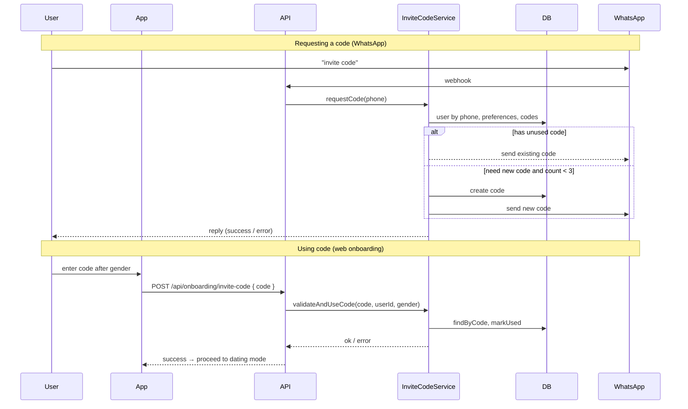

# Invite Code for Profile Creation

## Summary

- **When**: After the user selects gender in onboarding (web app or WhatsApp flow), show an invite-code step.
- **Rules**: Men need a code created by a woman; women need a code created by a man. Non-binary: define policy (e.g. can request codes usable by anyone; can use codes from Man or Woman).
- **Requesting codes**: User sends a message like "invite code" on WhatsApp. Requester must already have a profile with gender. Max 3 codes per user. Reuse latest unused code if any; otherwise create a new one (if under 3) and send via WhatsApp.
- **Persistence**: New `InviteCode` table; validate/consume code in onboarding and add `hasUsedInviteCode` to status.

---

## 1. Database: InviteCode model

**File:** [my-app/prisma/schema.prisma](my-app/prisma/schema.prisma)

Add a new model and relation on `User`:

- `id` (cuid), `code` (unique string, e.g. 8-char alphanumeric), `createdById` (User), `usedById` (User?, nullable), `status` (enum: `active` | `used`), `createdAt`, `updatedAt`.
- Index on `code` (unique), `createdById`, `usedById`.
- Relation: `User` has many `InviteCode` as creator (`createdBy`) and as consumer (`usedBy`).

Run `npx prisma migrate dev` to add the migration.

---

## 2. Invite code repository and service

- **InviteCodeRepository** (new): `create(createdById, code)`, `findByCode(code)`, `findActiveByCreator(userId)`, `countByCreator(userId)`, `markUsed(id, usedById)`.
- **InviteCodeService** (new):  
  - **Request code (WhatsApp flow):** Resolve user by phone (normalize phone for DB lookup: e.g. strip non-digits and ensure consistent format with `User.phone`). Load preferences to get `genderIdentity`. If no profile/gender, return message to complete profile in app. Count codes by this user; if < 3, find an active (unused) code for this user or create a new one (generate unique code, e.g. `nanoid` or random 8 chars). Mark that code as the one to send; send it via WhatsApp (see below). Reply with success or error (e.g. "You've reached the maximum of 3 invite codes").
  - **Validate and consume (onboarding):** `validateAndUseCode(code, userId, userGender)`. Find by code; ensure status is `active`; ensure creator’s gender is “opposite” (Man ↔ Woman; define Non-binary: e.g. allowed to use code from Man or Woman). If valid, call `markUsed(codeId, userId)` and return success; else throw with clear message.
- **Code generation:** Generate a short, URL-safe unique code; retry if collision (e.g. `code` unique constraint).

---

## 3. WhatsApp: send invite code and handle "invite code" message

- **Outbound WhatsApp:** Extend [my-app/src/services/TwilioService.ts](my-app/src/services/TwilioService.ts) (or add a small helper used by InviteCodeService) to send a WhatsApp message: `client.messages.create({ from: config.twilio.whatsappNumber, to: "whatsapp:" + toPhone, body })`. Ensure `toPhone` has correct format (e.g. E.164 with +). Expose e.g. `sendWhatsAppMessage(toPhone: string, body: string)`.
- **Bot:** In [my-app/src/services/WhatsAppBotService.ts](my-app/src/services/WhatsAppBotService.ts), before the step dispatcher, detect “invite code” (e.g. normalize message to lowercase and match `invite code` or `invitecode`). Call InviteCodeService “request code” with the phone (from `from`). Return the reply string (success with “We’ve sent your invite code to this number” or the actual code in message, or error). Do not change the current conversation step when handling this.

**Phone normalization:** When looking up user by phone from WhatsApp (`from.replace(/^whatsapp:/, "")`), ensure the value matches how `User.phone` is stored (e.g. if app stores with `+`, normalize to same format before `findByPhone`).

---

## 4. Onboarding: invite code step (web app)

- **Status:** In [my-app/src/repositories/OnboardingRepository.ts](my-app/src/repositories/OnboardingRepository.ts) `getOnboardingStatus`, add `hasUsedInviteCode`: true if there exists an `InviteCode` where `usedById === userId`.
- **New API:** `POST /api/onboarding/invite-code` body `{ code: string }`. Validates and consumes the code (InviteCodeService.validateAndUseCode) for the current user; user’s gender is read from Preferences. Returns 200 or 4xx with message (e.g. "Invalid or already used code", "This code is for women; you selected man").
- **Controller + validation:** In [my-app/src/controllers/OnboardingController.ts](my-app/src/controllers/OnboardingController.ts) add `validateInviteCode`; validation schema: `{ code: z.string().min(1).max(20).trim() }`.
- **OnboardingShell:**  
  - Insert **invite code step** after gender (current step 1). So: step 0 = profile, 1 = gender, **2 = invite code**, 3 = dating mode, 4 = who to meet, 5 = relationship goals, 6 = interests, 7 = personality, 8 = photos. Update `TOTAL_SUB_STEPS` to 9.  
  - In `getInitialSubStep(status)`: if `!status.hasUsedInviteCode` after having preferences (gender), return 2.  
  - Add state for invite code input and error. On "Next", call `apiPost("invite-code", { code })` then advance to step 3.  
  - UI: short explanation (“Men need an invite code from a woman; women from a man. Request one by messaging ‘invite code’ on WhatsApp.”), text input for code, validation error display.
- **Completion check:** In [my-app/src/services/OnboardingService.ts](my-app/src/services/OnboardingService.ts) `completeOnboarding`, add a check that `hasUsedInviteCode` is true (so user cannot complete without validating a code).

---

## 5. WhatsApp onboarding: invite code step

- In [my-app/src/services/WhatsAppBotService.ts](my-app/src/services/WhatsAppBotService.ts), after GENDER step, add step e.g. `INVITE_CODE`. After saving gender, transition to `INVITE_CODE` and send a message like “To continue, you need an invite code from [opposite gender]. Ask a [Man/Woman] to message us ‘invite code’ on WhatsApp, then enter the code they receive.”
- Add handler `handleInviteCode(phone, tempData, text)`: validate code via InviteCodeService (need to resolve userId from tempData or phone; get gender from preferences). If valid, advance to DATING_MODE and return next prompt; else return error and stay on INVITE_CODE.
- Ensure phone normalization when calling InviteCodeService from the bot (same as in “request code” path).

---

## 6. Gender matching rules

- **Creator → Consumer:** Code created by **Woman** → can be used by **Man**. Code created by **Man** → can be used by **Woman**.
- **Non-binary:** Recommend: (a) Non-binary can use a code from Man or Woman; (b) Non-binary can create codes that Men or Women can use. Implement in `validateAndUseCode` and in “request code” (Non-binary users can request codes; when validating, allow code from Man or Woman for Non-binary).

---

## 7. Files to add or touch (concise)


| Area                                       | Action                                                                                       |
| ------------------------------------------ | -------------------------------------------------------------------------------------------- |
| `prisma/schema.prisma`                     | Add `InviteCode` model and relation on `User`.                                               |
| `src/repositories/InviteCodeRepository.ts` | New; CRUD and count by creator.                                                              |
| `src/services/InviteCodeService.ts`        | New; request code (WhatsApp), validateAndUseCode.                                            |
| `src/services/TwilioService.ts`            | Add `sendWhatsAppMessage(toPhone, body)`.                                                    |
| `src/services/WhatsAppBotService.ts`       | Handle "invite code" intent; add INVITE_CODE step and handler.                               |
| `src/lib/container.ts`                     | Register InviteCodeRepository, InviteCodeService; inject where needed.                       |
| `OnboardingRepository.getOnboardingStatus` | Add `hasUsedInviteCode`.                                                                     |
| `OnboardingService`                        | Add `validateInviteCode(userId, code)`; in `completeOnboarding` require `hasUsedInviteCode`. |
| `OnboardingController`                     | Add `validateInviteCode`; add route `POST /api/onboarding/invite-code`.                      |
| `validations/onboarding.validation.ts`     | Add `inviteCodeSchema`.                                                                      |
| `OnboardingShell.tsx`                      | New step 2 (invite code), TOTAL_SUB_STEPS=9, getInitialSubStep, API call, UI.                |
| `onboarding/page.tsx`                      | Extend `OnboardingStatus` type with `hasUsedInviteCode` if needed.                           |


---

## 8. Flow diagrams




```mermaid
flowchart LR
  subgraph creation [Code creation]
    A[User sends "invite code" on WhatsApp]
    B[Resolve user and gender]
    C{Count codes by user < 3?}
    D[Find unused code or create new]
    E[Send code via WhatsApp]
    A --> B --> C --> D --> E
  end

  subgraph validation [Code use]
    F[User enters code in app]
    G[Check code active and creator gender]
    H{Man/Woman opposite?}
    I[markUsed and continue]
    F --> G --> H --> I
  end
```


---

## 9. Edge cases

- **Duplicate "invite code" requests:** Same logic: return existing unused code or create new (up to 3).
- **Phone format:** Normalize before `findByPhone` (e.g. digits only or E.164) so WhatsApp number matches stored `User.phone`.
- **Code expiry:** Optional later: add `expiresAt` and ignore expired codes in validation.

